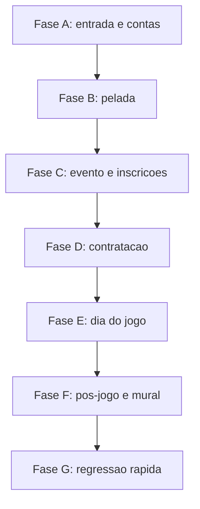

# Fluxo de testes — Ciclo de vida do Controle de Bola App

Roteiro **sequencial** para explorar cadastros e operacoes do app do inicio ao fim.

Complementa (nao substitui):

- [SMOKE-TEST-PRE-INSTALL.md](SMOKE-TEST-PRE-INSTALL.md) — checklist curto pre-APK
- [PLANO-TESTES-PERFIS.md](PLANO-TESTES-PERFIS.md) — matriz por papel (13 perfis)
- [GUIA-CICLO-DE-VIDA-E-ARQUITETURA.md](GUIA-CICLO-DE-VIDA-E-ARQUITETURA.md) — modelo e Cloud

**Ambiente sugerido:** web (`npm start` → http://localhost:8100) e/ou APK Android. iOS TestFlight quando a membership Apple estiver ativa (sem “Pendente”).

Marque `[x]` conforme for executando. Anote falhas com severidade **P0** (bloqueia) · **P1** (atrito) · **P2** (cosmetico).

---

## 0. Contas e fixture

Prepare antes (ou crie na Fase A/B):

| Conta | Papel no teste | Uso |
|-------|----------------|-----|
| **Admin** | Organiza pelada/evento | Criar pelada, evento, aprovar, pagamento, chegada, convites |
| **Atleta A** | `athlete` | Inscricao, chegada, team-split, voto |
| **Atleta B** | `athlete` | Segundo time / conflito de agenda (opcional) |
| **Contratado** | juiz ou scout | Inbox → aceitar convite |
| **Torcedor** | `fan` | Palpites / check-in (opcional na 1a passagem) |

Sugestao de nomes de teste: `teste.admin+cba@…`, `teste.atleta.a+cba@…`, etc. Senhas anotadas fora do git.

**Fixture minima:**

1. Uma **pelada** com admin conhecido.
2. Um **evento futuro** (inscricoes abertas), taxa conhecida (ou taxa zero).
3. Opcional: portaria QR ligada; apresentacao de perfil na 1a participacao.



---

## Fase A — Entrada, cadastro e perfil

Objetivo: validar o caminho ate as tabs.

```text
splash → onboarding? → login/register → profile-setup? → tabs/peladas
```

| ID | Passo | Conta | Esperado | OK |
|----|-------|-------|----------|----|
| A1 | Abrir app / `npm start` | — | Splash e depois onboarding ou login | [ ] |
| A2 | Onboarding (3 passos), se 1a vez | nova | Completa sem travar; segue para login/register | [ ] |
| A3 | **Criar conta** Admin | Admin | Captcha/anti-bot ok; conta criada; login automatico ou tela de login | [ ] |
| A4 | Profile-setup / caminho wizard | Admin | Perfil criado (atleta ou caminho escolhido); chega em **Peladas** | [ ] |
| A5 | Logout → Login | Admin | Sessao valida; tabs Peladas / Buscar / Mural / Perfil | [ ] |
| A6 | Criar conta Atleta A | Atleta A | Mesmo fluxo A3–A4; perfil atleta utilizavel | [ ] |
| A7 | Meus dados / data nascimento | qualquer | Picker dia/mes/ano (`app-birth-date-picker`), **nao** calendario nativo | [ ] |
| A8 | Abrir app com sessao salva | Admin | Nao pede login de novo (splash → tabs) | [ ] |

**Parar se P0:** nao consegue criar conta ou nao entra nas tabs.

---

## Fase B — Pelada (organizacao)

Objetivo: Admin cria e configura o “clube”.

| ID | Passo | Conta | Esperado | OK |
|----|-------|-------|----------|----|
| B1 | Criar pelada | Admin | `pelada-form` salva; aparece na lista | [ ] |
| B2 | Abrir pelada-detail | Admin | Segmentos: Eventos, Socios, Cotinhas, Caixa, Mensalidades, Mural, Config | [ ] |
| B3 | Configuracoes | Admin | Toggles/labels legiveis; max atletas / regras visiveis | [ ] |
| B4 | (Opcional) Socio | Atleta A → Admin | Solicitar socio / aprovar | [ ] |
| B5 | Mural da pelada (vazio) | Admin | Estado vazio claro, sem erro | [ ] |

---

## Fase C — Evento, inscricao e confirmacao efetiva

Objetivo: chegar em `isEffectivelyConfirmed` para atletas.

Campo critico: **`isEffectivelyConfirmed`** (pagamento, isencao, convite, taxa zero). Afeta lista publica, QR, voto, limite de atletas.

| ID | Passo | Conta | Esperado | OK |
|----|-------|-------|----------|----|
| C1 | Criar evento futuro | Admin | `event-create`; evento na pelada | [ ] |
| C2 | Abrir event-detail | Admin | Painel admin + participantes + contratacoes | [ ] |
| C3 | Inscrever Atleta A | Atleta A | `event-register`; registro criado | [ ] |
| C4 | Apresentacao de perfil (se ligada) | Admin | Aprovar em participantes / inbox da pelada | [ ] |
| C5 | Confirmar pagamento **ou** isentar **ou** taxa zero | Admin | Atleta A fica **confirmado efetivo** | [ ] |
| C6 | Lista de participantes (admin) | Admin | Atleta A visivel com status correto | [ ] |
| C7 | (Opcional) Inscrever Atleta B | Atleta B | Mesmo C3–C5 | [ ] |
| C8 | Conflito de agenda (se houver 2 eventos no mesmo horario) | Atleta A | App/Cloud avisa ou bloqueia | [ ] |

**Parar se P0:** inscricao nao grava ou confirmacao efetiva nao “liga”.

---

## Fase D — Contratacao (inbox)

Objetivo: profissional entra pelo convite, nao pela inscricao aberta de atleta.

| ID | Passo | Conta | Esperado | OK |
|----|-------|-------|----------|----|
| D1 | Perfil do papel (juiz/scout) | Contratado | Role profile preenchido | [ ] |
| D2 | Enviar convite no hiring panel | Admin | Convite pendente; badge se houver | [ ] |
| D3 | Caixa de entrada | Contratado | Convite visivel | [ ] |
| D4 | Aceitar convite | Contratado | Vira inscricao do papel; `isEffectivelyConfirmed` | [ ] |
| D5 | Voltar ao evento | Contratado | CTA do papel aparece (sumula / scout / etc.) | [ ] |
| D6 | (Opcional) Recusar outro convite | outro user | Estado recusado claro para o admin | [ ] |

---

## Fase E — Dia do jogo (operacao)

Objetivo: chegada → times → ferramentas de campo → midia.

Ordem sugerida no **mesmo evento**:

| ID | Passo | Conta | Esperado | OK |
|----|-------|-------|----------|----|
| E1 | Marcar chegada dos atletas | Admin | Ordem de chegada refletida | [ ] |
| E2 | Separacao de times | Admin | Toque no atleta → time; media de votos se houver | [ ] |
| E3 | Portaria / ingresso QR (se ligado) | Admin + Atleta | QR valido entra; invalido rejeita | [ ] |
| E4 | Copiar PIX (se taxa) | Atleta/Admin | Botao copia; feedback | [ ] |
| E5 | Board scout | Scout/Contratado | Incrementa stats; persiste apos reload | [ ] |
| E6 | Sumula | Juiz | Salva apontamentos | [ ] |
| E7 | Palpites torcedor | Torcedor | Fecha no `startTime` | [ ] |
| E8 | Check-in torcida | Torcedor | Fluxo claro | [ ] |
| E9 | Radio / jornal (se houver perfil) | Narrador/Jornalista | Publica; aparece no mural do evento | [ ] |
| E10 | Apoio (treinador / PF / massagista / material) | papel | Ferramenta do papel abre e salva | [ ] |

---

## Fase F — Pos-jogo, votacao e mural

| ID | Passo | Conta | Esperado | OK |
|----|-------|-------|----------|----|
| F1 | Votacao no mural do evento | Atletas confirmados | Nota 0–10 na janela; fora da janela bloqueia | [ ] |
| F2 | Admin marca evento finalizado | Admin | `isFinished`; CTAs de jogo fecham conforme regra | [ ] |
| F3 | Mural do evento | qualquer | Rankings / destaques coerentes (quorum so como aviso, se aplicavel) | [ ] |
| F4 | Mural da pelada | qualquer | Reflete atividade do evento | [ ] |
| F5 | Mural do app (aba) | qualquer | Carrega sem erro | [ ] |
| F6 | Compartilhar card do mural (nativo) | Android/iOS | Share sheet; cancelar nao trava spinner | [ ] |
| F7 | Perfil publico atleta | qualquer | `/athlete/:userId` legivel | [ ] |

---

## Fase G — Regressao rapida (5–10 min)

Rodar apos qualquer mudanca grande ou antes de instalar APK/TestFlight. Espelha o smoke:

| # | Fluxo | OK |
|---|--------|----|
| G1 | Login / tabs / menu | [ ] |
| G2 | Pelada → Configuracoes (textos completos) | [ ] |
| G3 | Evento → Participantes (lista admin) | [ ] |
| G4 | Negociacao → convite + badge | [ ] |
| G5 | Inbox aceitar/recusar | [ ] |
| G6 | Team-split | [ ] |
| G7 | Portaria / PIX | [ ] |

Se Cloud Code mudou: `npm run build:cloud` + publicar `cloud/main.js` no Back4App **antes** desta fase.

---

## Ordem minima (1a exploracao, ~45–90 min)

Se quiser so o “caminho feliz” com 2 contas (Admin + Atleta A):

1. **A3–A6** — duas contas  
2. **B1–B3** — pelada  
3. **C1–C6** — evento + confirmacao efetiva  
4. **E1–E2** — chegada + times  
5. **F1–F5** — voto + murais  

Depois, numa 2a sessao: **Fase D** (contratado) e **E3–E10** (ferramentas de campo).

---

## Registro de sessao (copiar ao testar)

```text
Data:
Ambiente: [ ] web  [ ] Android  [ ] iOS TestFlight
Build / release:
Contas usadas:

P0:
P1:
P2:

Observacoes:
```

Consolidar achados relevantes em `docs/AUDITORIA-PERFIS-RESULTADOS.md` e, se for regressao recorrente, em `docs/AGENT-ACTIVITY-CACHE.md`.

## Planilha para testers (Excel)

Gerar / atualizar:

```bash
node scripts/generate-test-flow-xlsx.js
```

Arquivo gerado (enviar este):

`exports/Fluxo-Testes-Controle-de-Bola.xlsx`

Abas: **Como usar**, **Contas**, **Fluxo Ciclo de Vida**, **Por Perfil**, **Registro de Bugs**. A pasta `exports/` esta no `.gitignore` (nao sobe senhas preenchidas).

---

## Relacao com iOS / Apple

| Situacao Apple | O que testar neste fluxo |
|----------------|--------------------------|
| Membership **Pendente** | Fases A–G em **web + Android** |
| Membership **ativa** | Gerar IPA (`release-ipa`) → TestFlight → repetir Fase A + G1 no iPhone |
| Push iOS | Fora deste roteiro ate APNs/Firebase iOS |
