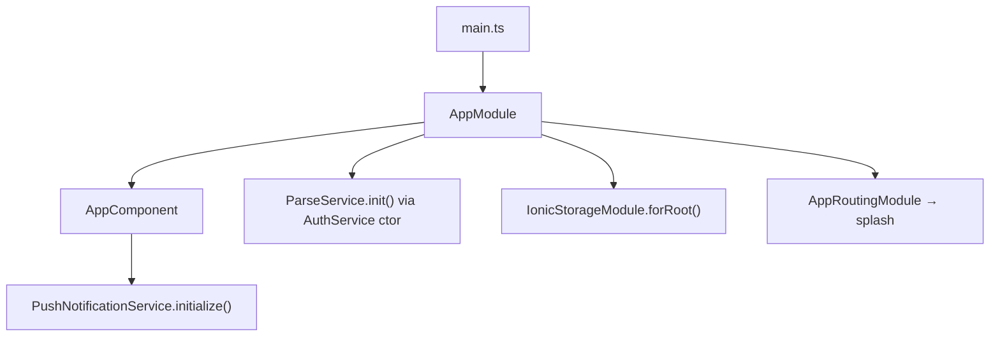
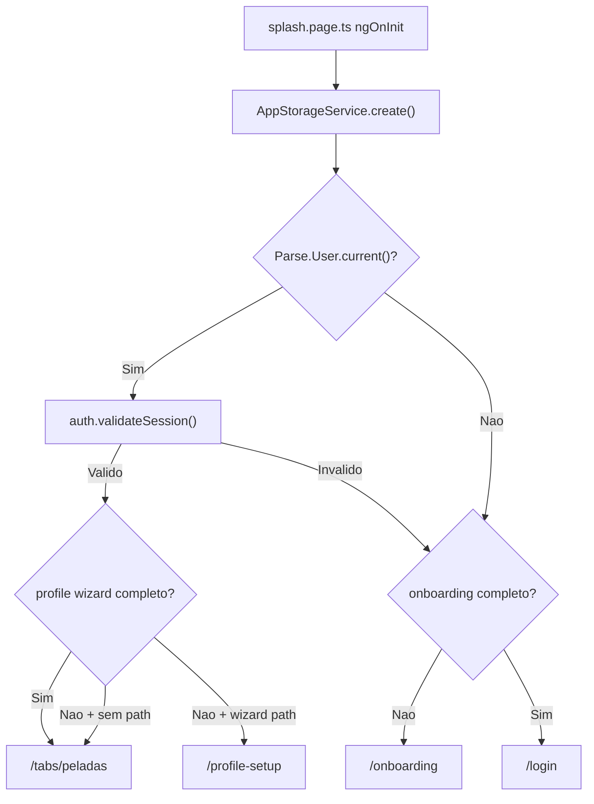
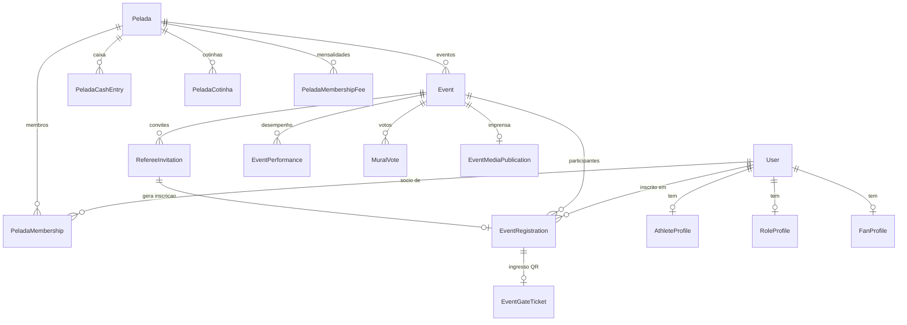
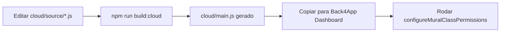
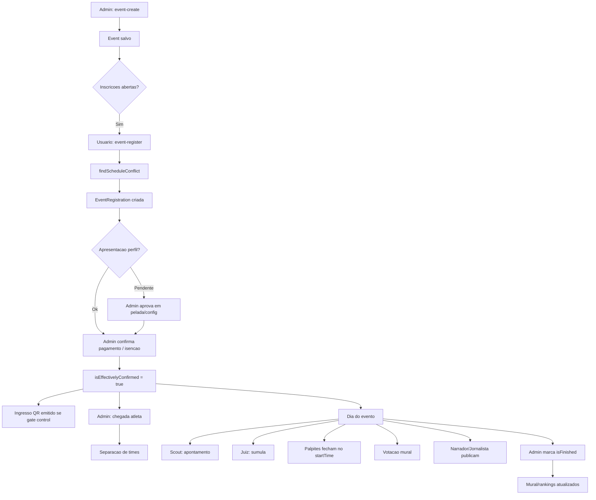
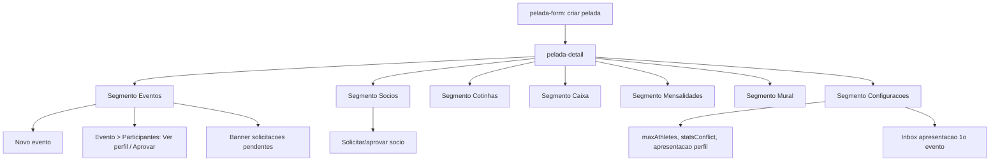
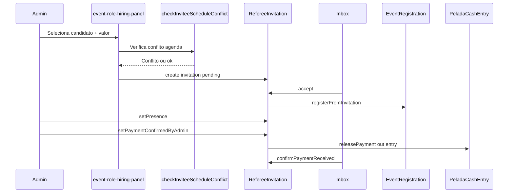
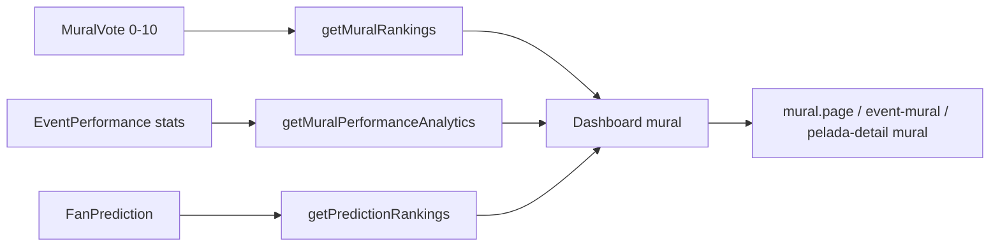

# Guia de Ciclo de Vida e Arquitetura — Controle de Bola App

Documento de referencia para manutencao e inovacao tecnologica. Leia **antes** de alterar codigo, Cloud Code ou fluxos de negocio.

**Versao do projeto:** `minhapelada@0.0.1`  
**Ultima revisao deste guia:** julho/2026

---

## Indice

1. [Visao geral e proposito](#1-visao-geral-e-proposito)
2. [Stack e pre-requisitos](#2-stack-e-pre-requisitos)
3. [Estrutura de pastas](#3-estrutura-de-pastas)
4. [Ciclo de vida de execucao](#4-ciclo-de-vida-de-execucao)
5. [Roteamento e guardas](#5-roteamento-e-guardas)
6. [Autenticacao e pos-login](#6-autenticacao-e-pos-login)
7. [Perfis e papeis](#7-perfis-e-papeis)
8. [Modelo de dados (Parse)](#8-modelo-de-dados-parse)
9. [Backend / Cloud Code](#9-backend--cloud-code)
10. [Servicos Angular](#10-servicos-angular)
11. [Fluxos principais](#11-fluxos-principais)
12. [Convencoes e padroes](#12-convencoes-e-padroes)
13. [Pontos de atencao e dividas tecnicas](#13-pontos-de-atencao-e-dividas-tecnicas)
14. [Checklist para agentes](#14-checklist-para-agentes)

---

## 1. Visao geral e proposito

**Controle de Bola App** (repositorio `minhapelada`) e uma rede social voltada ao futebol amador. O objetivo principal vai alem do controle operacional de peladas: **causar emocao** — refletir resultados, desempenho e interacao social para que usuarios sintam satisfacao ao ver sua participacao registrada no app.

### Dominios funcionais

| Dominio | Descricao |
|---------|-----------|
| **Pelada** | Grupo recorrente (clube amador): socios, mensalidades, caixa, cotinhas, mural |
| **Evento** | Sessao/jogo dentro de uma pelada ou avulso: inscricoes, pagamento, chegada, times |
| **Perfis** | 13 papeis distintos (atleta, juiz, scout, torcedor, etc.) com formularios proprios |
| **Contratacao** | Admin convida profissionais/atletas/torcedores via `RefereeInvitation` |
| **Mural** | Rankings, votacao 0–10, highlights, analytics de desempenho |
| **Legends** | Catalogo de lendas amadoras/profissionais e times historicos |

### Tipos de evento

Definidos em `src/app/core/models/event.model.ts`:

| Tipo | Codigo | Uso |
|------|--------|-----|
| Pelada | `pelada` | Jogo informal do grupo |
| Racha | `racha` | Confronto entre grupos |
| Jogo entre equipes | `team_match` | Partida com times nomeados (casa/visitante) |

---

## 2. Stack e pre-requisitos

| Camada | Tecnologia | Versao |
|--------|------------|--------|
| Frontend | Ionic + Angular (NgModule, **nao** standalone) | Ionic 8, Angular 20 |
| Mobile | Capacitor | 8.x |
| Backend | Back4App (Parse Server) | Parse JS SDK 8.6 |
| Linguagem | TypeScript | 5.9 |
| Node | Node.js | 20+ |
| Android build | JDK | **21** (bundled com Android Studio) |

### Configuracao Back4App

1. Copiar `src/environments/environment.local.ts.example` → `environment.local.ts`
2. Preencher `appId` e `javascriptKey` (Dashboard → Security & Keys)
3. **Nunca** usar Master Key no app cliente
4. Servidor Parse: `https://parseapi.back4app.com` (nativo); web usa proxy `/parse` via `ng serve`

### Comandos essenciais

```bash
npm install
npm start                    # dev web em http://localhost:8100
npm run build                # build producao (www/)
npm run build:cloud          # gera cloud/main.js a partir de cloud/source/
npx cap sync android         # sincroniza www/ → projeto Android
```

**Instalacao Android (PowerShell):**

```powershell
npm run build; npx cap sync android
$env:JAVA_HOME = "C:\Program Files\Android\Android Studio\jbr"
$env:PATH = "$env:JAVA_HOME\bin;$env:PATH"
cd android; .\gradlew installDebug
adb shell am start -n com.minhapelada.app/.MainActivity
```

Documentacao complementar existente: `docs/back4app-fase*.md`, `docs/back4app-cloud-functions.md`.

---

## 3. Estrutura de pastas

```
minhapelada/
├── AGENTS.md                 # Entrada rapida para agentes de IA
├── README.md                 # Setup basico
├── docs/                     # Documentacao (este guia + fases Back4App)
├── cloud/
│   ├── source/               # MODULOS Cloud Code (editar aqui)
│   │   ├── 01-phone-helpers.js
│   │   ├── 02-core.js
│   │   ├── 03-push-notifications.js
│   │   ├── 04-auth-signup.js
│   │   ├── 05-legends.js
│   │   ├── 06-gate-tickets.js
│   │   ├── 07-mural.js
│   │   ├── 08-scout-referee-performance.js
│   │   ├── 09-events-registrations.js
│   │   ├── 10-pelada.js
│   │   ├── 11-profiles-search.js
│   │   └── 12-event-media.js
│   └── main.js               # GERADO — nao editar (npm run build:cloud)
├── scripts/
│   └── build-cloud-code.js   # Concatena source/ → main.js
├── android/                  # Projeto Capacitor Android
└── src/app/
    ├── core/
    │   ├── guards/           # AuthGuard
    │   ├── models/           # Interfaces TypeScript (espelham Parse)
    │   ├── services/         # 37 servicos (Parse + Cloud)
    │   └── utils/            # Helpers (parse-error, arrival-order, etc.)
    ├── pages/                # ~45 paginas lazy-loaded
    ├── shared/
    │   └── components/       # Componentes reutilizaveis (panels, forms)
    └── tabs/                 # Shell de navegacao (4 abas visiveis)
```

### Convencao de paginas

Cada pagina segue o padrao Ionic/Angular:

```
pages/<nome>/
  <nome>.page.ts          # Logica + ionViewWillEnter
  <nome>.page.html        # Template
  <nome>.page.scss        # Estilos
  <nome>.module.ts        # Lazy module
  <nome>-routing.module.ts
```

---

## 4. Ciclo de vida de execucao

### Bootstrap



**Arquivos-chave:**

| Arquivo | Responsabilidade |
|---------|------------------|
| `src/main.ts` | `platformBrowserDynamic().bootstrapModule(AppModule)` |
| `src/app/app.module.ts` | Ionic, Storage, `IonicRouteStrategy` |
| `src/app/app.component.ts` | Shell `<ion-router-outlet>`, init push |
| `src/app/core/services/parse.service.ts` | `Parse.initialize()`, URL web vs nativo |
| `src/app/core/services/app-storage.service.ts` | Flags locais (onboarding, wizard, biometria) |

### Decisao de rota inicial (Splash)



**Regra importante:** paginas Ionic sao **cacheadas** pelo `IonicRouteStrategy`. Por isso dados sao recarregados em `ionViewWillEnter`, nao apenas em `ngOnInit`.

---

## 5. Roteamento e guardas

### Rotas publicas (sem AuthGuard)

| Rota | Pagina |
|------|--------|
| `/splash` | Splash |
| `/onboarding` | Onboarding (3 passos) |
| `/login` | Login |
| `/register` | Criar conta |

### Rotas protegidas (`canMatch: [AuthGuard]`)

Todas as demais rotas em `src/app/app-routing.module.ts`, incluindo:

- `/tabs/*` — navegacao principal
- `/pelada/:id`, `/pelada-create`, `/pelada/:id/edit`
- `/event/:id`, `/event/:id/register`, `/event/:id/mural`, `/event/:id/scout`, etc.
- `/inbox`, `/legends`, `/profile/:role/:userId`, `/athlete/:userId`

**AuthGuard** (`src/app/core/guards/auth.guard.ts`): chama `authService.validateSession()`; redireciona para `/login` se invalido.

### Abas (tabs)

`src/app/tabs/tabs.page.html` — **4 abas visiveis:**

| Aba | Rota | Conteudo |
|-----|------|----------|
| Peladas | `/tabs/peladas` | Lista de peladas (padrao) |
| Buscar | `/tabs/search` | Busca de eventos/perfis |
| Mural | `/tabs/mural` | Mural geral do app |
| Perfil | `/tabs/profile` | Meu perfil |

**Nota:** a rota `/tabs/events` existe em `tabs-routing.module.ts` mas **nao aparece** na barra de abas.

---

## 6. Autenticacao e pos-login

### AuthService (`src/app/core/services/auth.service.ts`)

| Metodo | Comportamento |
|--------|---------------|
| `login()` | Tenta variantes de email/telefone; fallback Cloud `resolveLoginUsername` |
| `register()` | Cloud `registerUser` → login; fallback client-side `signUp` |
| `validateSession()` | `user.fetch()` no servidor; em erro de rede nao desloga |
| `clearLocalSession()` | Unregister push + `Parse.User.logOut()` |
| `handleApiError()` | Se sessao invalida → limpa sessao, retorna `true` (caller redireciona `/login`) |

### Pos-autenticacao

`PostAuthNavigationService.navigateAfterAuth()` decide destino:

1. Wizard completo → `/tabs/peladas`
2. Sem wizard path → `/tabs/peladas`
3. Wizard incompleto → `/profile-setup`

### Profile setup

`profile-setup.page.ts`: cria `AthleteProfile`, `FanProfile` ou `RoleProfile` conforme `WizardPath` escolhido no onboarding; marca wizard completo e vai para `/tabs/peladas`.

### Cadastro (anti-bot)

Cloud `prepareSignupChallenge` + campos honeypot no formulario (`register.page.ts`). Fallback local se Cloud indisponivel.

---

## 7. Perfis e papeis

### Os 13 ProfileRole

Definidos em `src/app/core/models/profile-role.model.ts`:

| Codigo | Label | Perfil Parse | Contratavel |
|--------|-------|--------------|-------------|
| `athlete` | Atleta | AthleteProfile | Sim |
| `referee` | Juiz | RoleProfile | Sim (so convite) |
| `scout` | Scout/Mesario | RoleProfile | Sim |
| `journalist` | Jornalista | RoleProfile | Sim |
| `cameraman` | Cinegrafista | RoleProfile | Sim |
| `narrator` | Narrador | RoleProfile | Sim |
| `coach` | Treinador | RoleProfile | Sim |
| `physical_trainer` | Preparador Fisico | RoleProfile | Sim |
| `masseur` | Massagista | RoleProfile | Sim |
| `kitman` | Roupeiro | RoleProfile | Sim |
| `gandula` | Gandula | RoleProfile | Sim |
| `gatekeeper` | Porteiro | RoleProfile | Sim |
| `fan` | Torcedor | FanProfile | Sim |

### Familias derivadas

| Tipo | Arquivo | Descricao |
|------|---------|-----------|
| `ProfessionalRole` | `role-profile.model.ts` | Todos exceto athlete e fan |
| `HireableRole` | `event-hiring.model.ts` | Todos os 13 (admin pode contratar) |
| `MuralTargetRole` | `event-performance.model.ts` | Votaveis no mural (athlete separado de goalkeeper) |

### Capacidades por papel no evento

| Papel | Acoes principais |
|-------|------------------|
| **athlete** | Inscricao, chegada, team split, votacao, stats |
| **referee** | So via convite; sumula; contrata auxiliares de bandeira |
| **scout** | Apontamento scout; contrata auxiliares de marcacao |
| **journalist** | Publica reportagem/entrevista (titulo/texto/foto) no mural; engajamento (views/reacoes/comentarios) |
| **narrator** | Publica narracao de gol / entrevista (audio + titulo/descricao) no mural; engajamento |
| **cameraman** | Cobertura: video de melhores momentos (≤5 min) no mural (1 por evento, sobrescreve); engajamento |
| **gatekeeper** | Ferramentas de portaria (scan QR, lista de entradas) |
| **coach** | Painel de escala/checklist/notas taticas (`/event/:id/coach-board`) |
| **physical_trainer** | Plano pre-jogo, aquecimento e sessao (`/event/:id/physical-trainer`) |
| **masseur** | Fila/ficha de atendimento amador (`/event/:id/masseur-treatments`) |
| **fan** | Palpites, votacao, check-in da torcida (`/event/:id/fan-checkin`); pode ser remoto ou presencial |

### Legends (lendas)

Fluxo em `pages/legends-hub/`, `legend-athlete-form/`, `legend-team-form/`, `legend-pro-athlete-form/`.

Cloud: `cloud/source/05-legends.js` — CRUD de lendas amadoras/profissionais; alimenta sugestoes de idolos e times nos formularios de perfil.

---

## 8. Modelo de dados (Parse)

### Diagrama de relacoes centrais



### Classes principais

#### Identidade

| Classe | Proposito | Campos-chave |
|--------|-----------|--------------|
| `_User` | Conta | username, email, phone, apelido, address, avatarUrl, primaryRole |
| `SignupChallenge` | Captcha cadastro | expectedAnswer, expiresAt |

#### Pelada e financas

| Classe | Proposito | Campos-chave |
|--------|-----------|--------------|
| `Pelada` | Grupo/clube | name, sport, admin→User, address, monthlyFee, maxAthletesPerEvent, statsConflictSource |
| `PeladaMembership` | Vinculo socio | pelada, user, status (active/pending/inactive), role |
| `PeladaMembershipFee` | Mensalidade | membership, referenceMonth, amount, paymentConfirmed |
| `PeladaCashEntry` | Caixa | pelada, date, type (in/out), amount, refereeInvitationId |
| `PeladaCotinha` | Vaquinha | pelada, title, targetAmount, status |
| `PeladaCotinhaPayment` | Contribuicao | cotinha, user, amount, confirmedByAdmin |
| `PeladaMemberSanction` | Expulsao/ban | pelada, user, remainingEventBlocks |

#### Eventos

| Classe | Proposito | Campos-chave |
|--------|-----------|--------------|
| `Event` | Sessao/jogo | pelada, admin, type, startTime/endTime, registrationOpensAt/ClosesAt, participationFee, gateTicketControlEnabled, maxAthletesPerEvent, voting/sumula/scout windows |
| `EventRegistration` | Participante | event, user, role, apelido, paymentConfirmed, paymentExempt, **isEffectivelyConfirmed**, arrivalOrder, gateTicketToken, profilePresentationStatus |
| `RefereeInvitation` | Convite contratacao | event, invitedUser, role, status, offeredAmount, responseDeadline, presenceConfirmed, paymentReleased |
| `EventPerformance` | Stats por atleta/evento | goals, assists, saves, cards, scout*/referee* overlap fields |
| `FanPrediction` | Palpite | event, user, topScorer, scores, cards |
| `FanEventCheckIn` | Check-in da torcida | event, user, attendanceMode, message, checkedInAt |
| `CoachEventBoard` | Painel do treinador | event, coachUser, checklist, teamNotes, suggestedStarters, rotationNotes |
| `MasseurTreatment` | Atendimento amador | event, masseurUser, athleteUser, phase, bodyRegion, treatmentType, returnStatus |
| `PhysicalTrainerSession` | Sessao do preparador | event, trainerUser, planFocus, planDurationMin, athleteUserIds, warmup* |

Cloud de apoio: `cloud/source/14-support-roles.js` (`submitFanCheckIn`, `saveCoachEventBoard`, `upsertMasseurTreatment`, `savePhysicalTrainerSession`, rankings/resumo, `configureSupportRolesClassPermissions`).

#### Social / Mural

| Classe | Proposito | Campos-chave |
|--------|-----------|--------------|
| `MuralVote` | Voto 0–10 | scope (app/pelada/event), targetUser, targetRole, score |
| `EventMediaPublication` | Imprensa (1 por evento) | radio*, journal*, **highlightVideo*** (titulo/descricao/url/duracao), viewCounts, pelada |
| `EventMediaVote` | (legado) Nota 0–10 — UI removida; engajamento via reacoes/comentarios | event, category, score |
| `EventMediaView` | Visualizacao unica por usuario | event, category, viewer |
| `EventMediaReaction` | Curtida estilo Facebook | event, eventId, category, user, reaction; opcional `commentId` |
| `EventMediaComment` | Comentarios e respostas | event, category, user, text, parentCommentId? |

#### Perfis

| Classe | Proposito |
|--------|-----------|
| `AthleteProfile` | Posicoes, medidas, taxas pelada/match |
| `RoleProfile` | Taxas por tipo de evento, equipamentos, PIX |
| `FanProfile` | Taxas presencial/remoto, acceptsPaidCommitments |

#### Catalogos

| Classe | Proposito |
|--------|-----------|
| `AmateurTeam` | Time amador (escudo, presidente) |
| `AmateurLegendAthlete/Team`, `ProLegendAthlete` | Lendas historicas |

### Campo critico: `isEffectivelyConfirmed`

Calculado client-side (`computeEffectiveConfirmation` em `event.model.ts`) e server-side (`computeRegistrationEffectiveConfirmation` em Cloud). Determina:

- Visibilidade na lista publica de participantes
- Emissao automatica de ingresso (gate ticket)
- Elegibilidade para votacao (sempre por `_User`, nunca por RoleProfile)
- Contagem de vagas de atletas (`maxAthletesPerEvent`)

Retorna `true` quando: taxa zero, isento, convidado por contrato/arbitro, anonimo, ou pagamento confirmado — e **nao** esta com apresentacao de perfil pendente/rejeitada.

**Votacao:** um usuario confirma a cédula uma unica vez (`submitEventMuralBallot`). **Integridade:** nao pode votar em si mesmo (pode votar em colegas do mesmo time ou adversarios); `MuralVote` so via Cloud (CLP). Rankings/destaques do evento continuam visiveis mesmo com poucos votantes; o app exibe nota de integridade quando ha &lt;3 votantes distintos. Midia: engajamento por reacoes/comentarios; views de TOP so de participantes confirmados (nao-autor); TOP midia exige ≥3 views.

**Sumula:** edicao apenas pelo juiz confirmado dentro de `sumulaOpensAt`/`sumulaClosesAt`. Apos o encerramento do evento, qualquer perfil confirmado (ou admin) consulta em modo leitura.

**Preparador fisico:** `savePhysicalTrainerSession` so antes de `event.startTime`.

### Controle de material (pelada / ropeiro)

Classes Parse: `MaterialInventoryItem` (estoque) e `EventMaterialSession` (carga/envio/conferencia por evento).

| Onde | Quem | Acao |
|------|------|------|
| Pelada → Configuracoes → **Material** | Admin da pelada | Cadastro (uniforme por cor + equipamentos) |
| Perfil → **Material do Ropeiro** | Usuario com perfil kitman | Cadastro do estoque proprio |
| Evento → **Material** | Admin e/ou ropeiro do evento | Origem: pelada / ropeiro / nao controla; carregar; enviar; contagem cega; devolucao; baixas |

**Avaria:** campo qualificativo (defeito). Nao reduz a quantidade utilizavel no evento — material com qtd > 0 pode ser carregado mesmo com avarias. Na conferencia (recebido do admin/ropeiro ou devolucao) e possivel informar novas avarias; o Cloud soma no `damagedQuantity` do inventario (limitado ao total).

**Transito admin ↔ ropeiro:**
- Na carga, coluna **Qtd.Evento** vem preenchida com o disponivel (editavel).
- Se a origem for **pelada** e o inventario da pelada estiver vazio, avisar para cadastrar em Configuracoes → Material (nao confundir com falta de ropeiro).
- Envio ao ropeiro so libera com ropeiro contratado/inscrito no evento (somente um); botao: `Enviar material ao Ropeiro (Nome)`.
- Se o admin definiu origem **pelada**, o ropeiro nao pode trocar para material proprio.

Fluxo tipico (material da pelada): admin carrega e envia → ropeiro faz contagem cega (+avarias) → admin recebe devolucao (+avarias) → divergencias → aplicar baixas no inventario (faltas/perdas).

Cloud: `listMaterialInventory`, `upsertMaterialInventoryItem`, `deleteMaterialInventoryItem`, `getEventMaterialSession`, `setEventMaterialSource`, `loadEventMaterial`, `sendEventMaterial`, `submitEventMaterialBlindCount`, `receiveEventMaterialReturn`, `applyEventMaterialLosses`, `configureMaterialClassPermissions`.

### Apresentacao de perfil (1a participacao)

Quando `Pelada.requireProfilePresentationOnFirstEvent` esta ativo, a inscricao recebe `profilePresentationStatus: pending` e nao fica confirmada ate o admin aprovar.

**Ponto principal de revisao:** detalhe do evento → painel **Participantes** (botoes Ver perfil / Aprovar / Recusar no card do inscrito). A lista admin (`listEventRegistrationsForAdmin`) inclui `profilePresentationStatus`.

**Inbox na pelada:** card **Solicitacoes de participacao** no segmento Eventos (quando ha pendencias) e tambem em Configuracoes.

---

## 9. Backend / Cloud Code

### Workflow de build e deploy



**Regras:**

- Prefixos numericos (`01`–`12`) definem ordem de concatenacao (helpers primeiro)
- **Nunca** editar `cloud/main.js` diretamente
- Apos deploy, executar `configureMuralClassPermissions` uma vez (ou job `configureMuralClassPermissionsJob`)
- Demais CLPs pos-deploy: `configureMaterialClassPermissions`, `configureSupportRolesClassPermissions`, `configureEventMediaClassPermissions`
- Procedimento no dashboard (REST POST `/functions/...` + Master Key; erros comuns): [BACK4APP-CLOUD-FUNCTIONS-CONSOLE.md](BACK4APP-CLOUD-FUNCTIONS-CONSOLE.md)

### Modulos Cloud Code

| Modulo | Arquivo | Responsabilidade |
|--------|---------|------------------|
| 01 | `01-phone-helpers.js` | Normalizacao telefone BR |
| 01b | `01b-comment-discipline.js` | Filtro palavroes |
| 01c | `01c-integrity-helpers.js` | Integridade mural/midia (anti-self, quorum) |
| 02 | `02-core.js` | Login, conta, senha |
| 03 | `03-push-notifications.js` | Push, triggers Event/Registration |
| 04 | `04-auth-signup.js` | Cadastro anti-bot, beforeSave User |
| 05 | `05-legends.js` | CRUD lendas, sugestoes idolos/times |
| 06 | `06-gate-tickets.js` | Ingressos QR, validacao, entradas |
| 07 | `07-mural.js` | Rankings, votos, dashboards, CLP |
| 08 | `08-scout-referee-performance.js` | Scout, sumula, palpites, penalties |
| 09 | `09-events-registrations.js` | Chegada, listas, pagamento, convites suplementares, conflito agenda |
| 10 | `10-pelada.js` | Socios, apresentacao perfil, participantes |
| 11 | `11-profiles-search.js` | Busca atletas/perfis, perfil publico |
| 12 | `12-event-media.js` | Radio, jornal, video highlight, views/reacoes/comentarios, tops |
| 13 | `13-material.js` | Inventario pelada/ropeiro; sessao envio/conferencia por evento |

### Cloud Functions por categoria (principais)

**Auth:** `prepareSignupChallenge`, `registerUser`, `resolveLoginUsername`, `updateUserAccount`, `changeUserPassword`

**Eventos/Inscricoes:** `listEventParticipantsForVoting`, `updateEventRegistrationPayment`, `createAnonymousEventRegistration`, `registerEventAthleteArrival`, `ensureEventArrivalOrders`, `getEventTeamSplit`, `saveEventTeamSplit`, `checkInviteeScheduleConflict`, `createSupplementaryEventInvitation`

**Portaria:** `getMyEventGateTicket`, `issueEventGateTicket`, `cancelEventGateTicket`, `validateEventGateTicket`, `listEventGateEntries`

**Mural:** `getMuralAppDashboard`, `getEventMuralDashboard`, `getMuralRankings`, `castEventMuralVote`, `getMuralPerformanceAnalytics`, `getPredictionRankings`, `configureMuralClassPermissions`

**Imprensa/Midia:** `getEventMediaDashboard`, `publishEventRadioNarration`, `publishEventRadioInterview`, `publishEventJournalReportage`, `publishEventJournalInterview`, `publishEventHighlightVideo`, `castEventMediaVote`, `recordEventMediaView`, `setEventMediaReaction`, `upsertEventMediaComment`, `getEventMediaEngagement`, `getTopEventMedia`, `configureEventMediaClassPermissions`. Detalhes: [EVENT-MEDIA.md](EVENT-MEDIA.md).

**Scout/Sumula:** `getScoutApontamentoBoard`, `incrementScoutApontamento`, `getRefereeSumulaBoard`, `saveRefereeSumulaBoard`

**Pelada:** `listPeladasForFeed`, `getPeladaDisplayInfo`, `listPeladaProfilePresentationRequests`, `resolveProfilePresentationRequest`, `listPeladaActiveSocios`, `listPeladaMembershipsForAdmin`

**Push:** `registerPushDevice`, `unregisterPushDevice`, `setPushNotificationsEnabled`, `getPushNotificationsEnabled`, `sendEventConfirmedParticipantNotification`, `runEventRemindersTwoHours`, `backfillAndroidPushInstallations`, `diagnosePushForContact`, `diagnoseEventPushTargets`, `sendTestPushToSelf`, `pruneStalePushInstallationsForUser`. Preferência `_User.pushNotificationsEnabled` (toggle no menu). Inventário: [PUSH-NOTIFICATIONS.md](PUSH-NOTIFICATIONS.md).

**Push jobs:** `sendEventRemindersTwoHoursJob` (agendar a cada 10–15 min no Back4App).

### Triggers

| Trigger | Classe | Efeito |
|---------|--------|--------|
| `beforeSave` | `Parse.User` | Anti-bot no cadastro |
| `beforeSave` | `EventRegistration` | Apresentacao de perfil pendente |
| `afterSave` | `Event` | Push novo evento; remarcacao/cancelamento; auto-emissao ingressos |
| `afterSave` | `EventRegistration` | Push apresentacao perfil; auto-emissao ingresso |
| `afterSave` | `RefereeInvitation` | Push convite e resposta de contratacao |

### Autorizacao server-side

Quase todas as funcoes usam `{ useMasterKey: true }`. A autorizacao e feita **manualmente** dentro de cada funcao (checagem de login, admin, role). Nao confiar apenas em ACL/CLP.

---

## 10. Servicos Angular

Todos em `src/app/core/services/`. Padrao: tentam Cloud Function primeiro; fallback para query Parse client-side se funcao indisponivel.

### Infraestrutura

| Servico | Responsabilidade |
|---------|------------------|
| `parse.service.ts` | Init SDK Parse |
| `parse-file.service.ts` | Upload Parse.File (imagens/audio) |
| `app-storage.service.ts` | Ionic Storage (flags locais) |
| `address-geocoding.service.ts` | Geocoding Nominatim/Photon |
| `post-auth-navigation.service.ts` | Roteamento pos-login |
| `auth.service.ts` | Login, cadastro, sessao, conta |

### Pelada e financas

| Servico | Classe Parse / Cloud |
|---------|---------------------|
| `pelada.service.ts` | Pelada CRUD |
| `pelada-membership.service.ts` | PeladaMembership |
| `pelada-cash.service.ts` | PeladaCashEntry |
| `pelada-cotinha.service.ts` | PeladaCotinha + Payment |
| `pelada-monthly-fee.service.ts` | PeladaMembershipFee |

### Eventos

| Servico | Classe Parse / Cloud |
|---------|---------------------|
| `event.service.ts` | Event CRUD |
| `registration.service.ts` | EventRegistration; cloud listas, pagamento, chegada |
| `referee-invitation.service.ts` | RefereeInvitation; cloud convites suplementares |
| `event-gate-ticket.service.ts` | Gate tickets (cloud 06) |
| `team-split.service.ts` | Team split (cloud 09) |
| `event-media.service.ts` | Imprensa (cloud 12): radio/jornal/video + engajamento + tops |

### Perfis

| Servico | Classe Parse / Cloud |
|---------|---------------------|
| `athlete-profile.service.ts` | AthleteProfile |
| `role-profile.service.ts` | RoleProfile |
| `fan-profile.service.ts` | FanProfile |
| `athlete-search.service.ts` | Cloud search/list hiring |
| `profile-search.service.ts` | Cloud searchProfiles |
| `profile-presentation-request.service.ts` | Cloud apresentacao perfil |

### Stats e Mural

| Servico | Cloud principal |
|---------|----------------|
| `mural.service.ts` | 07-mural (dashboards, votos, rankings) |
| `scout-apontamento.service.ts` | 08 (board scout) |
| `referee-sumula.service.ts` | 08 (board sumula) |
| `fan-prediction.service.ts` | FanPrediction + rankings |
| `support-role-tools.service.ts` | Torcida/treinador/PF/massagista (14) |
| `event-performance.service.ts` | EventPerformance |
| `athlete-performance.service.ts` | Dashboards analytics |
| `mural-highlights.service.ts` | Highlights |
| `mural-participant-stats.service.ts` | Stats localizacao |
| `mural-location-top.service.ts` | Top por cidade/estado |

### Outros

| Servico | Responsabilidade |
|---------|------------------|
| `push-notification.service.ts` | Registro device, deep links |
| `team.service.ts` | AmateurTeam |
| `amateur-legend.service.ts` | Legends (cloud 05) |
| `role-profile-history.service.ts` | Historico participacao |
| `user-participation-profile.service.ts` | Agregacao perfis do usuario |

### Event buses (RxJS Subjects)

| Servico | Observable | Quando emite |
|---------|------------|--------------|
| `auth.service` | `onProfileChanged` | Login, perfil salvo |
| `pelada.service` | `onPeladasChanged` | CRUD pelada |
| `event.service` | `onEventsChanged` | CRUD evento |
| `registration.service` | `onRegistrationsChanged` | Inscricao alterada (+ emite onEventsChanged) |
| `referee-invitation.service` | `onChanged` | Convite alterado |
| `team.service` | `onTeamChanged` | Time salvo |

Paginas inscrevem no construtor e recarregam em `ionViewWillEnter`; sempre `unsubscribe` em `ngOnDestroy`.

---

## 11. Fluxos principais

### 11.1 Ciclo de vida do evento



**Paginas envolvidas:** `event-create`, `event-detail`, `event-register`, `event-team-split`, `event-scout-apontamento`, `event-sumula`, `event-predictions`, `event-mural`, `event-narrator-radio`, `event-journalist-journal`, `event-cameraman-coverage`, `event-mural-media` (radio/jornal/video), `event-gate-scan`, `event-gate-entries`.

### 11.2 Ciclo da pelada



### 11.3 Contratacao / Negociacao



**Paginas:** `event-detail` (painel hiring), `inbox`, `event-supplementary-hiring`.

### 11.4 Mural e resultados

Tres escopos: `app` (mural geral), `pelada`, `event`.



**Integridade (Cloud `01c-integrity-helpers.js`):**
- Anti auto-voto (voto em colega do mesmo time ou adversario permitido)
- Nota de integridade quando ha &lt;3 votantes distintos (rankings/destaques continuam visiveis)
- Location tops: entradas com votos precisam de ≥3 votos no papel
- `MuralVote` CLP: create/update/delete so via Cloud

**Componentes shared:** `mural-participant-stats` (no evento/pelada, bairros começam colapsados com contagem), `mural-highlights-panel`, `mural-prediction-rankings`, `mural-performance-analytics`.

**Mural do evento (UX):** palpites e TOP 10 de perfis de apoio ficam atras dos botoes "Ver melhores palpites" e "Outros TOP 10...". Perfis de apoio no mural da pelada/app usam media das notas por evento (media de cada evento / qtd de eventos com nota).

Contagens de notas e agregados deduplicam por `voterId` (usuario Parse), nao por perfil.

---

## 12. Convencoes e padroes

### Data de nascimento (anti-regressao)

**Nunca** usar `ion-input type="date"` em Meus dados / cadastro / lendas. Usar `app-birth-date-picker` (dia/mes/ano). Documentacao dedicada: [UI-DATAS-NASCIMENTO.md](UI-DATAS-NASCIMENTO.md).

### Change Detection (OnPush)

Paginas/componentes com `changeDetection: ChangeDetectionStrategy.OnPush` **devem** chamar `cdr.markForCheck()` apos:

- Conclusao de `async/await`
- Callbacks de Subjects (onEventsChanged, etc.)
- Alteracao de `@Input()` via logica interna

Exemplos: `event-detail.page.ts`, `peladas.page.ts`, `events.page.ts`, paineis `event-detail-*`.

### Carregamento de dados

```typescript
// Padrao canonico
ionViewWillEnter(): void {
  void this.loadData();
}

constructor() {
  this.sub = this.someService.onChanged.subscribe(() => void this.loadData());
}

ngOnDestroy(): void {
  this.sub?.unsubscribe();
}
```

### Cloud-first com fallback

```typescript
try {
  return await Parse.Cloud.run('someFunction', params);
} catch (error) {
  if (isInvalidCloudFunctionError(error)) {
    return this.fallbackClientQuery();
  }
  throw error;
}
```

### Denormalizacao

Campos `apelido`, `userName`, `avatarUrl`, `participantUserId` sao copiados para `EventRegistration`, `MuralVote`, `PeladaMembership`, etc. Propagacao via Cloud `updateUserAccount` e `syncUserAvatarForDisplay`. **Risco:** copias defasadas se propagacao falhar.

### Validacao de erros Parse

Usar `parseErrorMessage()` e `isInvalidSessionError()` de `src/app/core/utils/parse-error.util.ts`.

### Formularios reativos

Componentes custom (`app-birth-date-picker`, `app-address-form`) implementam `ControlValueAccessor` + `Validator`. Chamar `notifyValidationChange()` / `registerOnValidatorChange` para sincronizar validacao com formulario pai.

---

## 13. Pontos de atencao e dividas tecnicas

| Item | Impacto | Acao recomendada |
|------|---------|------------------|
| Cloud Code nao publicado | Funcoes retornam erro; app usa fallback limitado | Publicar `cloud/main.js` apos cada alteracao em `cloud/source/` |
| CLP nao configurado | Permissoes Parse inconsistentes | Rodar `configure*ClassPermissions` via REST+Master Key — ver [BACK4APP-CLOUD-FUNCTIONS-CONSOLE.md](BACK4APP-CLOUD-FUNCTIONS-CONSOLE.md) |
| Financas sem Cloud Code | `PeladaCashEntry`, `Cotinha`, `Fee` gerenciados so no cliente | Considerar Cloud functions para integridade |
| Denormalizacao | Dados de exibicao defasados | Verificar propagacao apos mudancas em conta/avatar |
| `@capacitor/status-bar` | Dependencia declarada, nao usada em `src/` | Remover ou implementar |
| Aba `/tabs/events` | Rota existe mas nao aparece na barra | Decidir: remover rota ou adicionar aba |
| Scout vs Referee stats | Campos `scout*`/`referee*` coexistem em EventPerformance | Respeitar `Pelada.statsConflictSource` |
| JDK Android | Capacitor 8 exige Java 21 | Usar JBR do Android Studio no build |

---

## 14. Checklist para agentes

Antes de implementar qualquer alteracao:

- [ ] Li este guia e o `AGENTS.md` na raiz
- [ ] Identifiquei a **pagina** (`src/app/pages/`), **servico** (`src/app/core/services/`) e **classe Parse** / **Cloud function** afetados
- [ ] Se alterar backend: edito apenas `cloud/source/*.js` e executo `npm run build:cloud`
- [ ] Se alterar UI com OnPush: incluo `cdr.markForCheck()` onde necessario
- [ ] Dados recarregados em `ionViewWillEnter`, nao so `ngOnInit`
- [ ] Testei com `npm run build` (sem erros TypeScript)
- [ ] Se Cloud Code alterado: lembrei de publicar no Back4App
- [ ] Nao commitei `environment.local.ts` nem Master Key
- [ ] Verifiquei impacto em `isEffectivelyConfirmed` se tocar inscricoes/pagamento
- [ ] Verifiquei propagacao de campos denormalizados se tocar perfil/conta

---

## Referencias rapidas

| Recurso | Caminho |
|---------|---------|
| Entrada para agentes | `/AGENTS.md` |
| Setup basico | `/README.md` |
| Fases Back4App | `/docs/back4app-fase*.md` |
| Cloud functions doc | `/docs/back4app-cloud-functions.md` |
| Modelos TypeScript | `/src/app/core/models/` |
| Servicos | `/src/app/core/services/` |
| Cloud source | `/cloud/source/` |
| Rotas | `/src/app/app-routing.module.ts` |
